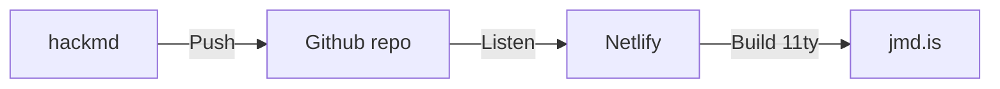

## The basic authoring process:
- write content on hackmd or other markdown editor
- push to Github repo
- Netlify watches the repo for changes and builds a new Eleventy (11ty) site

## /now
To set up the `/now` page I had to:
- create a rewrite in `netlify.toml` to `/pages/now/`
- manually edit the navigation template (include) to hardcode the link

